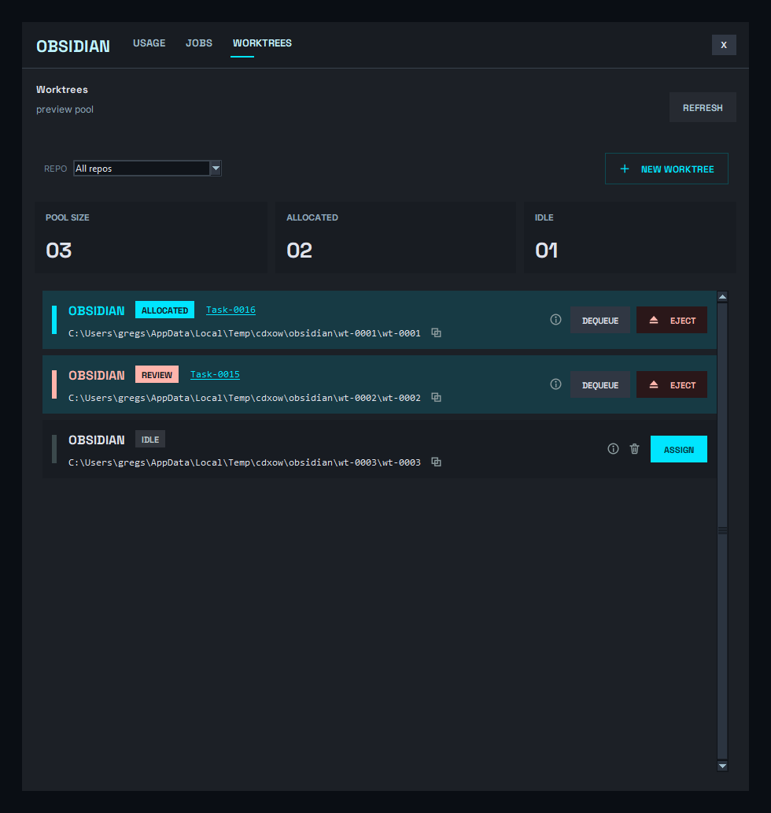
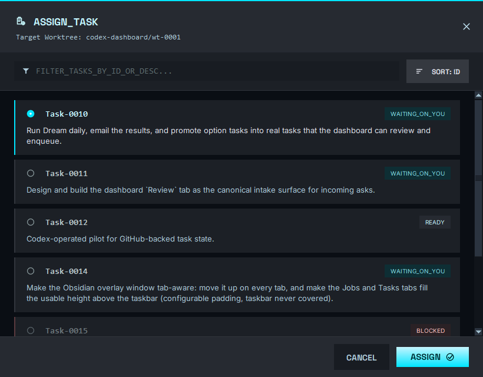

# WORKTREE card — mockup conformance review

Redesigned the WORKTREES-tab worktree panels to conform to the Stitch "Monolithic
Terminal" mockup (`C:\Users\gregs\Downloads\stitch_codex_token_velocity_overlay (4)\screen.png`
+ `code.html`) after the human's live feedback. Rendered through the real `DashboardApp`
surface (PrintWindow capture, no backend) with a fixed preview pool: one live allocated
slot, one parked allocated slot (needs review), one idle slot.

## What changed (per the human's directives)

- **Single horizontal row, no bottom button drawer** — actions are right-justified on the
  row, exactly like the mockup.
- **Accent stripe**: 2× wider (6px) and ~66% height, vertically centered — a status bar,
  not a full-height hairline.
- **Repo name FIRST, UPPERCASE** (`OBSIDIAN`), then the status chip.
- **Mockup color scheme**: allocated = cyan, idle = gray, needs-review (a parked run gate)
  = red; the red also drives the **EJECT** button (Assign stays the cyan accent).
- **Status chip** = a solid 0px-radius pill: cyan `ALLOCATED` / red `REVIEW` / gray `IDLE`.
- **Full local dir** shown in monospace (**Consolas**, the mockup's clean mono — not blocky
  Courier), **white**, with the **copy control inline at the end of the path**.
- **Crisp icons**: all glyphs (copy / details / destroy / close / filter / sort / radio /
  check / assignment_add) are rendered via [glyphs.py](../../../../app/codex_dashboard/glyphs.py)
  with **4× PIL supersampling + LANCZOS downscale** (anti-aliased, not "8-bit" 1px Canvas
  lines).
- **Bound task id is a clickable link** to its running GitHub issue (e.g. `Task-0016` →
  `https://github.com/Digital-Collective-Games/Obsidian/issues/16`), on the heading line.
  **No agent-model chip** (the mockup's `smart_toy` "Claude-3.5-Sonnet" is excluded — E4).
- **Right-justified actions**: Details (ⓘ) + DEQUEUE + EJECT for allocated; Details + a
  Destroy (trash) icon + ASSIGN for idle. Each icon is borderless, accent-on-hover, with a
  hover tooltip naming the action.
- **Tab + card buttons** are flat mockup-style (grounded in mockup-4): ghost-cyan
  **`+ NEW WORKTREE`** (renamed from CREATE WORKTREE), quiet **`REFRESH`** (renamed from
  REFRESH STATUS), ghost-red **`⏏ EJECT`**, quiet **`DEQUEUE`**, solid-cyan **`ASSIGN`** —
  matching the popup's button family.

## ASSIGN_TASK popup — mockup conformance

Redesigned the Assign popup to the second Stitch mockup
(`stitch_codex_token_velocity_overlay (5)\screen.png` + `code.html`).

- **Cyan top border**; tonal layering (header/footer `surface-container-high` #262a31,
  toolbar/cards `surface-container` #1c2026, list `surface-container-lowest` #0a0e14) with
  toolbar/footer divider hairlines.
- **Header**: `assignment_add` icon + `ASSIGN_TASK` title + `Target Worktree:`
  subtitle (mono) + close **X**.
- **Toolbar**: `FILTER_TASKS_BY_ID_OR_DESC...` field (live filter) + `SORT: ID` (toggles
  id asc/desc).
- **Task cards**: radio + task id + a color-coded status chip (`WAITING_ON_YOU` / `READY`
  cyan family, `BLOCKED` orange-red) + description. **Selected** = cyan left border + a
  solid filled cyan radio + cyan id; **blocked** = orange border, muted/disabled (not
  selectable).
- **Footer**: `CANCEL` + an **`ASSIGN`** primary CTA rendered as a baked image with the
  mockup's vertical **cyan gradient glow** (`#c3f5ff`→`#00e5ff`), heavy Space Grotesk text,
  and a `check_circle` glyph.
- New pure helpers (testable): `task_state_category` / `task_state_chip_label` /
  `task_is_assignable` / `filter_task_options` / `sort_task_options` /
  `first_assignable_task_id`.

## Verification

- `python -m py_compile` clean; full unit suite green (**189 tests**) — added glyph-render
  tests ([test_glyphs.py](../../../../tests/test_glyphs.py)) and Assign-popup task-helper
  tests.
- **Adversarial multi-dimension fidelity review** (8-agent workflow, twice): each reviewer
  compared the rendered capture against the mockup image **and** its source HTML across
  typography / layout / spacing / color / icons / buttons / component-semantics. After the
  first round's fixes, the re-review reported **0 blocking** discrepancies; color, icons,
  and buttons verdict **match**.
- Preview harnesses: [preview_card.py](../Runtime/preview_card.py),
  [preview_popup.py](../Runtime/preview_popup.py) (task-owned, throwaway; `Testing/Runtime/`
  is gitignored so the harnesses are not committed).

## Remaining gate

This is a visual redesign of surfaces REG-010 (cards) and REG-019 (Assign popup) cover;
before closure it still needs a fresh clean-context INTERFACE-DESIGNER review + REG-010/019
re-captures against the live tab.
